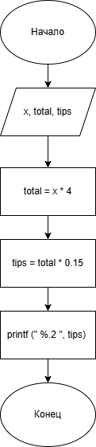

# Домашнее задание 2 к работе 3 варианта 

## Условие задачи
Четыре человека пообедали в ресторане. Официант подал им счет на Х руб. каждому. Они решают оставить официанту чаевые в размере 15% от счета. Составьте программу, которая выведет на экран сумму чаевых, которую получил официант.

## 1. Алгоритм и блок-схема

### Алгоритм
1. **Начало**
2. Объявить константы:
   - B = 4 - количество человек
   - C = 0.15 - процент чаевых

3. Задать исходные данные:
   - A - сумма счета на одного человека (руб.)

4. Вычислить общий счет:
   - total = A * B

5. Вычислить сумму чаевых:
   - tips_s = total * 0.15

6. Вывести результаты расчетов:
   - вывести количество человек
   - вывести сумму счета на одного человека
   - вывести общий счет
   - вывести сумму чаевых

7. Конец

### Блок-схема

[https://app.diagrams.net/](https://app.diagrams.net/)

## 2. Реализация программы
#include <stdio.h>
#include <locale.h>

int main() {
    setlocale(LC_CTYPE, "");
    // Конкретные значения по условию задачи
    float A = 850.0;  // Счет на одного человека - 850 руб.
    int B = 4;       // Количество человек
    float C = 15.0;    // Процент чаевых - 15%

    // Расчеты
    float total = A * B;
    float tips = total * (C / 100);

    // Форматированный вывод результатов
    printf("============================================\n");
    printf("          РАСЧЕТ ЧАЕВЫХ В РЕСТОРАНЕ\n");
    printf("============================================\n");
    printf("УСЛОВИЯ ЗАДАЧИ:\n");
    printf(" Количество человек: %d\n", B);
    printf(" Счет на одного человека: %.2f руб.\n", A);
    printf(" Процент чаевых: %.0f%%\n", C);
    printf("\n");
    printf("РАСЧЕТЫ:\n");
    printf(" Общий счет: %.2f руб. * %d = %.2f руб.\n",
        A, B, total);
    printf(" Сумма чаевых: %.2f руб. * %.0f%% = %.2f руб.\n",
        total, C, tips);
    printf("\n");
    printf("РЕЗУЛЬТАТ:\n");
    printf(" Официант получит чаевые: %.2f руб.\n", tips);
    printf("============================================\n");

    int x;
    int result;

    printf("Введите сумму счета на одного человека (руб.): ");
    result = scanf_s("%d", &x);

    double tips_s = x * 4 * 0.15;
    printf("Сумма чаевых: %.2f руб.\n", tips_s);

    return 0;

}

## 3. Результаты работы программы

============================================
          РАСЧЕТ ЧАЕВЫХ В РЕСТОРАНЕ
============================================
УСЛОВИЯ ЗАДАЧИ:
 Количество человек: 4
 Счет на одного человека: 850.00 руб.
 Процент чаевых: 15%

РАСЧЕТЫ:
 Общий счет: 850.00 руб. * 4 = 3400.00 руб.
 Сумма чаевых: 3400.00 руб. * 15% = 510.00 руб.

РЕЗУЛЬТАТ:
 Официант получит чаевые: 510.00 руб.
============================================
Введите сумму счета на одного человека (руб.):

## 4. Информация о разработчике

Чумачек Владислав, бИЦ-252
